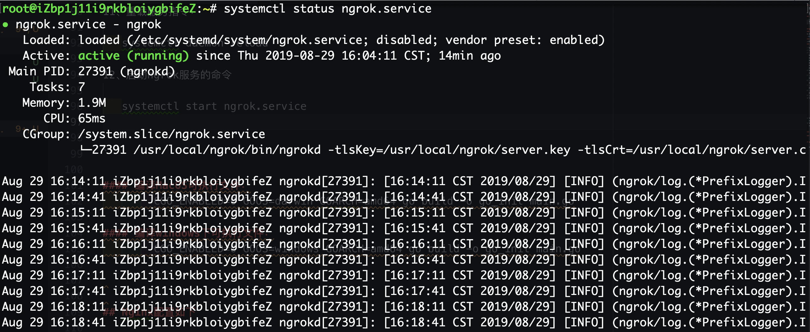
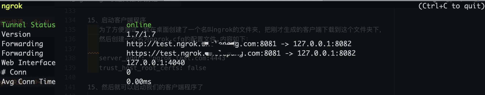

## 开始

   网上关于ngrok的内网穿透实践的文章已经很多了，也很详细。通过实践也达到了相要的效果。所以自己也打算输出
   一篇关于自己实际操作的步骤，以便初次尝试的童鞋看了文章可以少走些弯路。

   假定看这篇文章的童鞋和我一样，对Nginx及Nginx相关配置有一定的了解。我们先简单介绍下ngrok，
   ngrok 是一个反向代理，通过在公共的端点和本地运行的 Web 服务器之间建立一个安全的通道。
   ngrok 可捕获和分析所有通道上的流量，便于后期分析和重放。

### 准备工作

```
1、需要一台外网可以访问的服务器
2、一个公网域名
3、安装golang
4、安装git

```    

### 步骤

#### 解析域名
```
域名解析如下图，我的域名DNS是在阿里云解析的，增加两条A记录只想服务器IP地址如下。DNS解析速度很快，一般修改后立马生效。
```


#### 安装golang
```
我的电脑是已经安装过go环境的，至于golang的安装，网上很多文章已经写的很清楚了，在这里我们就不再赘述。
```
#### 下载Ngrok并安装

```
1、Ngrok的下载地址：https://github.com/tutumcloud/ngrok

2、进入到ngrok目录下，cd ngrok

3、生成自签名证书

   NGROK_DOMAIN="ngrok.test.com"  #注意这里域名换成你自己解析的域名
   
   openssl genrsa -out base.key 2048
   
   openssl req -new -x509 -nodes -key base.key -days 10000 -subj "/CN=$NGROK_DOMAIN" -out base.pem
   
   openssl genrsa -out server.key 2048
   
   openssl req -new -key server.key -subj "/CN=$NGROK_DOMAIN" -out server.csr

   openssl x509 -req -in server.csr -CA base.pem -CAkey base.key -CAcreateserial -days 10000 -out server.crt
 
4、执行完成后需要替换证书
   
   cp base.pem assets/client/tls/ngrokroot.crt

5、编译客户端和服务端（编译成功后会在bin目录下找到ngrokd和ngrok这两个文件。其中ngrokd 就是服务端程序了）

   make release-server release-client

6、编译windows下可执行的客户端（编译的文件在 ngrok/bin/windows_amd64/下的ngrok文件）

   GOOS=windows GOARCH=amd64 make release-client

7、编译linux下可执行的客户端

   GOOS=linux GOARCH=amd64 make release-client #32位系统把amd64改成386

8、编译Macos下可执行的客户端（编译的文件在 ngrok/bin/darwin_amd64/下的ngrok文件）

   GOOS=darwin GOARCH=amd64 ./make.bash

9、将文件下载到本机（由于本人使用的是macos，下载的是编译后的macos版本的客户端)

10、制作服务端自启动脚本
   
      1）、在/etc/systemd/system/目录下创建服务ngrok.service，
      注意我的ngrok放在/usr/local/文件夹内，以下/usr/local/ngrok/目录请替换为你自己的目录，
      域名及监听端口号请自行修改，内容为
      [Unit]
      Description=ngrok
      After=network.target
      
      [Service]
      ExecStart=/usr/local/ngrok/bin/ngrokd -tlsKey=/usr/local/ngrok/server.key -tlsCrt=/usr/local/ngrok/server.crt -domain=ngrok.test.com -httpAddr=:80 -httpsAddr=:443
      
      [Install]
      WantedBy=multi-user.target

11、重载服务指令：

   systemctl daemon-reload

12、启动ngrok服务的命令

   systemctl start ngrok.service # 启动服务

   systemctl stop ngrok.service # 停止服务

13、systemctl status ngrok.service 可查看当前服务状态：

```


```

14、Nginx 配置如下：
  
   server {
         listen 80;
         server_name *.ngrok.test.com ngrok.test.com;
         location / {
         proxy_pass  http://127.0.0.1:8081;
         proxy_redirect off;

         proxy_set_header X-Real-IP $remote_addr;
         proxy_set_header X-Forwarded-For $proxy_add_x_forwarded_for;
         proxy_set_header Host  $http_host:8081;
         proxy_set_header X-Nginx-Proxy true;
         proxy_set_header Connection "";

         client_max_body_size 10m; 
         client_body_buffer_size 128k;

         proxy_connect_timeout 90; 
         proxy_read_timeout 90; 
         proxy_buffer_size 4k;  
         proxy_buffers 6 128k;
         proxy_busy_buffers_size 256k;
         proxy_temp_file_write_size 256k;
        }
      }

15、启动客户端程序
   为了方便测试，我在桌面创建了一个名叫ngrok的文件夹，把刚才生成的客户端下载到这个文件夹下，
   然后创建一个名为ngrok.cfg的配置文件,内容如下：
   
   server_addr: "ngrok.test.com:4443"  
   trust_host_root_certs: false

15、然后就可以启动我们的客户端程序了

   ./ngrok -config=ngrok.cfg -log=ngrok.log -subdomain=test 8082

解释：-log 为日志文件，-subdomain为域名前缀， 8082为本地服务端口号

```

